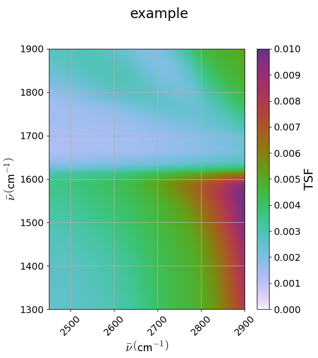

.. scripts:

Some examples using the ``phasematching_calc`` module are shown. 

Example 1. A 2D calculation of M factors and conversion into a ``WrightTools.data`` object.

First, the files are loaded into an IsoSample object:

.. plot::
    lay1file=os.path.join(filepath, 'CaF2_Malitson.txt')
    lay2file=os.path.join(filepath, 'H2O_1.txt')

    tkcaf2=0.02 
    tkwater=0.01 

    samp1=pc.IsoSample.IsoSample()
    desc="FWM cell"
    samp1.description=desc
    samp1.loadlayer(lay1file, tkcaf2, label="caf2fw")
    samp1.loadlayer(lay2file, tkwater, label="water")
    samp1.loadlayer(lay1file, tkcaf2, label="caf2bw")

Then, the Lasers object is created from the Python commands (as opposed to being loaded from file):

.. plot::
    las=pc.Lasers.Lasers()
    arr1=[1800.0,2700.0,30000.0]
    las.addfrequencies(arr1)
    arr2=[20.0,7.0, 0.0]
    las.addangles(arr2)
    arr3=[-1,1,1]
    las.addkcoeffs(arr3)
    arr4=[1,1,1]
    las.addpolarizations(arr4)
    las.changegeometry("planar")

The above two objects signify we are looking at a DOVE process where the Lasers are at 1800, 2700, and 30000 cm-1,
the geometry is planar, and the first laser is the -k2 one while the others are k1 and k3.  The sample is a 
sandwich of caf2, water, and caf2 at thicknesses shown.

The simulated ``WrightTools`` Data conversion is shown in the next block.  One defines the numpy `linspace`s for the two independent
coordinates, the k1 and -k2 inputs.  Then a `for` loop cycles through each series of m,n elements and places it 
into a channel array that gets placed into a Data object.  The remaining code follows the WrightTools methodology
of using the linspaces as variables and plotting the result using the `artists.quick2D` method.

.. plot::
    var1=np.linspace(2450.00,2900.00,46)[:,None]
    var2=np.linspace(1300.0,1900.0,61)[None, :]
    var2a=np.linspace(1300.0,1900.0,61)

    ch1= np.zeros([len(var1), len(var2a)])
    for m in range(len(var1)):
        for n in range(len(var2a)):
            las.changefreq(1,var1[m])
            las.changefreq(2,var2a[n])
            Mlist,tklist,Tlist=pc.phasematch.Mcalc(samp1,las)
            ch1[m,n]=np.abs(Mlist[1])

    data=wt.Data(name="FWM cell water w/CaF2 planar DOVE")
    data.create_variable(name="w1", units="wn", values= var1)
    data.create_variable(name="w2", units="wn", values= var2)
    data.create_channel(name='Mfactor', values=ch1)
    data.transform("w1","w2")
    wt.artists.quick2D(data)
    plt.show()

.. image:: Figure_1.png

**Example 2**. A similar calculation with a single 300 micron CaF2 window and different input geometries,
in this case a `boxcars` geometry.

.. plot::
    lay1file=os.path.join(filepath, 'CaF2_Malitson.txt')
    tkcaf2=0.03 

    samp1=pc.IsoSample.IsoSample()
    desc="caf2window300um"
    samp1.description=desc
    samp1.loadlayer(lay1file, tkcaf2, label="caf2")

    las=pc.Lasers.Lasers()
    arr1=[1800.0,2700.0,18400.0]
    las.addfrequencies(arr1)
    arr2=[8.0,8.0, 8.0]
    las.addangles(arr2)
    arr3=[-1,1,1]
    las.addkcoeffs(arr3)
    arr4=[1,1,1]
    las.addpolarizations(arr4)
    las.changegeometry("boxcars")

    var1=np.linspace(2600.00,3200.00,61)[:,None]
    var2=np.linspace(1600.0,2200.0,61)[None, :]
    var2a=np.linspace(1600.0,2200.0,61)

    ch1= np.zeros([len(var1), len(var2a)])
    for m in range(len(var1)):
        for n in range(len(var2a)):
            las.changefreq(1,var1[m])
            las.changefreq(2,var2a[n])
            Mlist,tklist,Tlist=pc.phasematch.Mcalc(samp1,las)
            ch1[m,n]=np.abs(Mlist[0])  

    data=wt.Data(name="CaF2 300 micron boxcars DOVE")
    data.create_variable(name="w1", units="wn", values= var1)
    data.create_variable(name="w2", units="wn", values= var2)
    data.create_channel(name='Mfactor', values=ch1)
    data.transform("w2","w1")
    wt.artists.quick2D(data)
    plt.show()

.. image:: Figure_2.png

**Example 3**.  An angle solving routine for an oriented sapphire:acetonitrile:sapphire sample.
We assume the oriented sapphire limits its anisotropy to very small amounts that are neglected
and may approximate an isotropic sample.  This is reverting back to a planar geometry.  The Sympy
syntax requires the conversion of the `FiniteSet` to a `list`.  

.. plot::
    lay1file=os.path.join(filepath, 'CH3CN_paste_1.txt')
    lay2file=os.path.join(filepath, 'sapphire1.txt')

    tksap=0.02
    tkacn=0.01 

    samp1=pc.IsoSample.IsoSample()
    desc="FWM cell"
    samp1.description=desc
    samp1.loadlayer(lay1file, tksap, label="sapphire")
    samp1.loadlayer(lay2file, tkacn, label="acn")
    samp1.loadlayer(lay1file, tksap, label="sapphire")

    las=pc.Lasers.Lasers()
    arr1=[1800.0,2700.0,18400.0]
    las.addfrequencies(arr1)
    arr2=[8.0,-7.0, 0.0]
    las.addangles(arr2)
    arr3=[-1,1,1]
    las.addkcoeffs(arr3)
    arr4=[1,1,1]
    las.addpolarizations(arr4)
    las.changegeometry("planar")

    var1=np.linspace(2600.00,3200.00,61)[:,None]
    var2=np.linspace(1600.0,2200.0,61)[None, :]
    var2a=np.linspace(1600.0,2200.0,61)

    ch1= np.zeros([len(var1), len(var2a)])
    for m in range(len(var1)):
        for n in range(len(var2a)):
            las.changefreq(1,var1[m])
            las.changefreq(2,var2a[n])
            angleair2=pc.phasematch.SolveAngle(samp1,las,2,1)
            ch1[m,n]=(list(angleair2)[0])  

    data=wt.Data(name="angle check for w2")
    data.create_variable(name="w1", units="wn", values= var1)
    data.create_variable(name="w2", units="wn", values= var2)
    data.create_channel(name='angleforw2', values=ch1)
    data.transform("w2","w1")
    wt.artists.quick2D(data)
    plt.show()

.. image:: Figure_3.png

Note the check is for the -k2 beam (i.e., w2) and it is looking for phasematching in the acetonitrile layer (layernum=2).
For phasematching, the angle for w2 wants to be at large value for low values of |k2| and lower for high values.   There 
is not a strong dependence of the angle of k2 as |k1| changes.  

**Example 4**.  A frequency solving routine for an oriented sapphire:acetonitrile:sapphire sample.
The conditions are virtually identical to Example 3 except that a frequency solve for the high frequency
k3 beam is requested.  The code is not posted as it is nearly identical except for  replacing the
line `angleair2=pc.phasematch.SolveAngle(samp1,las,2,1)` with `angleair2=pc.phasematch.SolveFrequency(samp1,las,2,3)`.

.. image:: Figure_4.png

It is unusual that the bottom left data points are unplotted.  Iterations may have proceeded beyond the estimated
amount so that it could not find a solution, or none may have existed.  The expected w3 colors range from 18000 cm-1
at right to almost 30000 cm-1 at left, suggesting a very large change of colors required that may obviate the method
or require some additional laser modification for assistance.

**Example 5**.  A delta t check of the inputs in a thick sample.  A thick (1 mm) sample of acetonitrile is simulated
instead.  This thickness tends to be the upper limit for our liquid phase samples, as geometrical interactions
tend to limit thicknesses.  (Geometrical calculations may be instituted as a function in a later version.)  

The code starts normally:

.. plot::
    lay3file=os.path.join(filepath, 'CaF2_Malitson.txt')
    lay4file=os.path.join(filepath, 'CH3CN_paste_1.txt')
    lay5file=os.path.join(filepath, 'CaF2_Malitson.txt')

    tkcaf2=0.02 
    tkacn=0.1 

    samp1=pc.IsoSample.IsoSample()
    desc="FWM cell"
    samp1.description=desc
    samp1.loadlayer(lay5file, tkcaf2, label="caf2fw")
    samp1.loadlayer(lay4file, tkacn, label="ACN")
    samp1.loadlayer(lay3file, tkcaf2, label="caf2bw")

    las4=pc.Lasers.Lasers()
    arr1=[3150.0,2250.0,20000.0]
    las4.addfrequencies(arr1)
    arr2=[5.0,10.0,0.0]
    las4.addangles(arr2)
    arr3=[1,-1,1]
    las4.addkcoeffs(arr3)
    arr4=[1,1,1]
    las4.addpolarizations(arr4)
    las4.changegeometry("planar")

    tin,tout=pc.phasematch.calculatedeltats(samp1,las4)
    print(tin,tout)

Some additonal code is needed to convert the times into more meaningful ones.  For example, the mean of
all 4 inputs and output was determined per layer, and the difference from that mean plotted per input.
.. plot::
    for m in range(len(tin)):
        if m == 0:
            pass
        else:
            for i in range(len(tin[m])):
                tin[m][i]=tin[m][i]-tin[m-1][i]

    for i in range(len(tout)):
        if i ==0:
            pass
        else:
            tout[i]=tout[i]-tout[i-1]

    print(tin,tout)
    tlist=list()
    x1=list()
    x2=list()
    x3=list()
    x4=list()
    y1=list()
    y2=list()
    y3=list()
    y4=list()

    for m in range(len(tin)):
        tinvec=list(tin[m])
        tinvec.append(tout[m])
        avg=np.mean(tinvec)
        tinvec=np.asarray(tinvec-avg)
        for i in range(len(tinvec)):
            if (i==0):
                x1.append(m+1)
                y1.append(tinvec[i])
            elif (i==1):
                x2.append(m+1)
                y2.append(tinvec[i])
            elif (i==2):
                x3.append(m+1)
                y3.append(tinvec[i])
            elif (i==3):
                x4.append(m+1)
                y4.append(tinvec[i])
            else:
                pass

    plt.rcParams['figure.autolayout']=True
    plt.xlim(0,5)
    plt.ylim(-60.0,30.0)
    plt.grid()

    xn1=x1
    yn1=y1
    plt.scatter(xn1,yn1, c="red")

    xn1=x2
    yn1=y2
    plt.scatter(xn1,yn1, c="green")

    xn1=x3
    yn1=y3
    plt.scatter(xn1,yn1, c="blue")

    xn1=x4
    yn1=y4
    plt.scatter(xn1,yn1, c="black")
    plt.show()

Note the `scatter` plot does not show axes.  X is the layer number and y is the delta in femtoseconds each
input or output makes relative to the mean of the 4 at the end of the layer.  Red is input 1, green is input 2, 
blue is input 3, and black is the output.  At layer 3 input 1 and 2 or overlapped.   The first input makes a
40 fsec departure from the other inputs at the end of the acetonitrile layer, because the pulse is 
near a strong absorption that will "delay" it. However, in general all four are within 20 fsec of each other and
so with pulses 10x or wider in time there should be negligible effects on signal contributions due to delaying.

**Example 6**.  A simple angle and frequency check.   Reverting back to the thin caf2:acetonitrile:caf2 sample,
a set of two frequency and angle solves are made for what may be considered two nearby data points to see 
how much of either should be made to achieve phasematching for both points.

.. plot::
    #new IsoSample: sapphire: ACN: sapphire
    lay3file=os.path.join(filepath, 'CaF2_Malitson.txt')
    lay4file=os.path.join(filepath, 'CH3CN_paste_1.txt')

    tksapph=0.02 #cm
    tkacn=0.01 #cm

    # generation of a IsoSample
    samp1=pc.IsoSample.IsoSample()
    desc="FWM cell"
    samp1.description=desc
    samp1.loadlayer(lay3file, tksapph, label="caf2fw")
    samp1.loadlayer(lay4file, tkacn, label="ACN")
    samp1.loadlayer(lay3file, tksapph, label="caf2bw")

    # new Lasers object
    las4=pc.Lasers.Lasers()
    arr1=[3150.0,2200.0,25000.0]
    las4.addfrequencies(arr1)
    arr2=[6.0,-15.0,0.0]  #**
    las4.addangles(arr2)
    arr3=[1,-1,1]
    las4.addkcoeffs(arr3)
    arr4=[1,1,1]
    las4.addpolarizations(arr4)
    las4.changegeometry("planar")

freq=pc.phasematch.SolveFrequency(samp1,las4,2,3,20)
out=list(freq)
print(out[0])

las4.changefreq(3,out[0])

las4.changefreq(2,2190.0)
angle=pc.phasematch.SolveFrequency(samp1,las4,2,3,20)
out2=list(angle)
print(out2[0])

las4.changefreq(3,out[0])
angle=pc.phasematch.SolveAngle(samp1,las4,2,2)
out3=list(angle)
print(out3[0])

Results are:
.. code-block:: python
    20540.0000000000
    20620.0000000000
    -14.9600000000000

    
In this example, changing w3 by +80 cm-1 would result in the same phasematching as an angle change of +0.04 degrees.
Changes in w3 in this range would result in very large wavelength changes needed over an entire scan.  On the 
other hand, phasematching angle changes may be restricted to a small range due to aberrations.  It is possible
that the two can be modified in tandem in some studies.

**Example 7**.  Comparison of DOVE vs TSF signal intensity.  WIth the oriented sapphire:water:sapphire sample,
a check was done between the two expected signal intensities generated by the water layer in two example
four-wave mixing modes (DOVE vs TSF).  The H2O signal was not phasematcheable in DOVE with the w3 wavelength.  
However, it is important to note that as w3 increases, the vector contributions of k1 and -k2 become
smaller relative to k3, and so phasemismatching becomes less problematic for DOVE.  

.. plot::
    lay1file=os.path.join(filepath, 'sapphire1.txt')
    lay2file=os.path.join(filepath, "H2O_1.txt")
    tksap=0.02 
    tkwat=0.01

    samp1=pc.IsoSample.IsoSample()
    desc="sapphwatersapph"
    samp1.description=desc
    samp1.loadlayer(lay1file, tksap, label="saphfw")
    samp1.loadlayer(lay2file, tkwat, label="h2o")
    samp1.loadlayer(lay1file, tksap, label="saphfw")

    las=pc.Lasers.Lasers()
    arr1=[1800.0,2700.0,30000.0]
    las.addfrequencies(arr1)
    arr2=[-18.0,8.0, 0.0]
    las.addangles(arr2)
    arr3=[-1,1,1]
    las.addkcoeffs(arr3)
    arr4=[1,1,1]
    las.addpolarizations(arr4)
    las.changegeometry("planar")

    #angle1=pc.phasematch.SolveAngle(samp1,las,1,1,frequency=1800.0)
    #print(list(angle1))
    #las.changeangle(1,list(angle1)[0])

    var1=np.linspace(2450.00,2900.00,91)[:,None]
    var2=np.linspace(1300.0,1900.0,161)[None, :]
    var2a=np.linspace(1300.0,1900.0,161)

    ch1= np.zeros([len(var1), len(var2a)])
    ch2=np.zeros([len(var1), len(var2a)])
    ch3=np.zeros([len(var1), len(var2a)])

    chartin,chartout=pc.phasematch.calculatedeltats(samp1, las)

    for m in range(len(var1)):
        for n in range(len(var2a)):
            las.changefreq(1,var1[m])
            las.changefreq(2,var2a[n])
            Mlist,tklist,Tdict=pc.phasematch.Mcalc(samp1,las)
            Alist, Alistout=pc.phasematch.calculateabsorbances(samp1,las) 
            Mlist1a=pc.phasematch.applyabsorbances(Mlist,Alist,Alistout)
            Mlist1b=pc.phasematch.applyfresneltrans(Mlist1a, Tdict)
            ch1[m,n]=Mlist[1]  

    vec2=[1,1,1]
    las.addkcoeffs(vec2)

    for m in range(len(var1)):
        for n in range(len(var2a)):
            las.changefreq(1,var1[m])
            las.changefreq(2,var2a[n])
            Mlist2,tklist2,Tlist2=pc.phasematch.Mcalc(samp1,las)
            ch2[m,n]=Mlist2[1]  

    ch3=ch1/ch2

    data=wt.Data(name="example")
    data.create_variable(name="w1", units="wn", values= var1)
    data.create_variable(name="w2", units="wn", values= var2)
    data.create_channel(name='DOVE', values=ch1)
    data.create_channel(name='TSF', values=ch2)
    data.create_channel(name="DOVE_TSF_RATIO", values=ch3)
    data.transform("w1","w2")
    wt.artists.quick2D(data, channel=0)
    plt.show()

    wt.artists.quick2D(data, channel=1)
    plt.show()

    wt.artists.quick2D(data, channel=2)
    plt.show()

.. image:: Figure_7c.png

The input geometry for DOVE is off.  It is more ideal for k1 and -k2 to be on the same side.   However,
the M factor is still quite large.  This calculation shows the effects of absorption within the water layer but
note that the application of absorbances from later layers was not shown (they were calculated but not put
into the graphic.)

Note the DOVE to TSF ratio can be up to a factor of 100 for this sample.  This is indicative of the expected
signal differences between the two processes strictly due to phase mismatching and not infrared or Raman
polarizabilities of compounds within the scan range.  A thin film of material would likely want to be added as 
an extra Layer, and the ratios between the two at that thin layer should approach 1 as it becomes small.

This comparison can be made with other samples.  Thicker, more transparent samples can yield DOVE/TSF ratios
into the 10^6 range.   